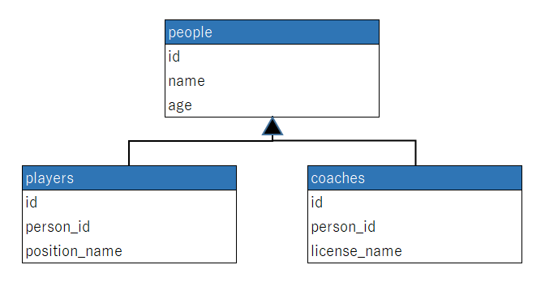

# ActiveRecord::Cti
ActiveRecord-Cti is a library implemented [Class Table Inheritance](https://martinfowler.com/eaaCatalog/classTableInheritance.html) on ActiveRecord.
Class Table Inheritance (CTI) is useful under the circumstances that an ActiveRecord object is in multiple positions or has multiple roles, and you want to describe it's structure on the database. 
For Example, one person may be a player and a coach in a soccer team.

## Why use activerecord-cti ?
In ActiveRecord, Single Table Inheritance(STI) is implemented as a method of how to express inheritance model on database. Class Table Inheritance (CTI) has more powerful and flexible expressiveness for inheritance model on database than it of STI.

For Example, Suppose you want to describe the following class structure on database.


But STI has a disadvantage that it is not possible to represent one record as an object of two different models at the same time.

#### persons talbe (STI)
| id | type | name      | birth_year | position_name   | licence_name |
|----|------|-----------|------------|-----------------|---------------|
| 1  |Player| Ryan Giggs|  1973      | midfielder      |               |
| 2  |Coach | Ryan Giggs|  1973      |                 | UEFA Pro      |

As mentiond above, for expressing two Person's subclasses objects, which are Player and Coach, you have to insert two records into persons table in STI.
It is cursed that the contents of name and birth_year columns are duplicated and position_name and licence_name columns are sparse.

CTI can solve these problems by using multiple related tables like shown below, literally for class table inheritance.



## How to use
### Configuration
First of all, generate the files of models you want to apply CTI to, and execute migration.

```bash
$ rails g model Person name:String birth_year:Integer
$ rails g model Player person_id:Integer position_name:String 
$ rails g model Coach person_id:Integer licence_name:String
$ rake db:migrate
```

Next, add the following line into Person model, which is base class.

```ruby
class Person < ApplicationRecord
  include ActiveRecord::Cti::BaseClass #added
end
```
By this mix-in, Person model is configured as base class in CTI, and automatically becomes abstract class as well.

And then, rewrite files of subclass models for inheriting base class.

```ruby
class Player < Person
end
```

```ruby
class Coach < Person
end
```

### Coding
To save data of Ryan Giggs as a football player, describe following:

```ruby
player = Player.new(name: 'Ryan Giggs', birth_year: 1973, position_name: 'midfielder')
player.save
```
So that his data is automatically split into two related tables.
```bash
MariaDB> SELECT * FROM persons limit 1;
+----+----------------+------------+
| id | name           | birth_year |
+----+----------------+------------+
|  1 | Ryan Giggs     | 1973       |
+----+----------------+------------+

MariaDB> SELECT * FROM players limit 1;
+----+----------------+---------------+
| id | person_id      | position_name |
+----+----------------+---------------+
|  1 | 1              | midfielder    |
+----+----------------+---------------+
```

Then, Ryan Giggs started coaching at Manchester United in 2013 as well as being a player.
To save the data of Giggs as a coach to DB, describe following:

```ruby
player = Player.find_by(name: 'Ryan Giggs')
coach = player.to_coach(licence_name: 'UEFA Pro')
coach.save
```

So that his data is newly inserted into only coaches table.
```bash
MariaDB> SELECT * FROM coaches limit 1;
+----+----------------+--------------+
| id | person_id      | licence_name |
+----+----------------+--------------+
|  1 | 1              | UEFA Pro     |
+----+----------------+--------------+
```

To get Ryan Giggs's Data as a coach, describe following:
```ruby
Coach.find_by_name('Ryan Giggs') #<Coach id: 1, name: "Ryan Giggs", licence_name: 'UEFA Pro'>
```

Like this, pserson_id, which coaches table has as foreign_key reffered to base class object, is concealed.

## Contributing
Contribution directions go here.

## License
The gem is available as open source under the terms of the [MIT License](https://opensource.org/licenses/MIT).
